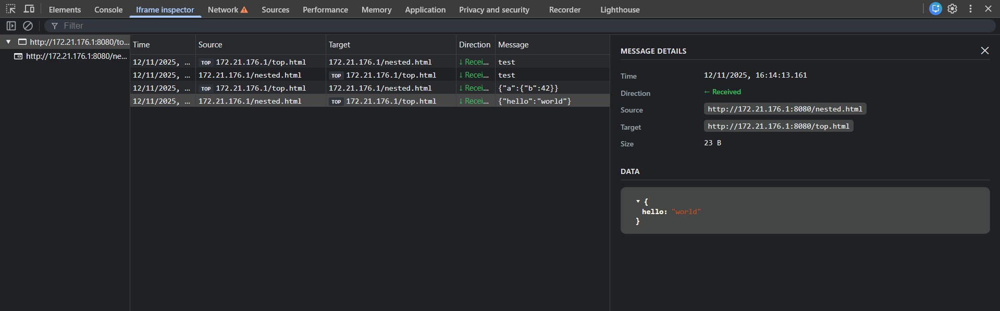

# Iframe inspector extension for Chrome and Firefox

> [!WARNING]
> This extension is still in the experimental phase.

  

An extension that helps you inspect iframes on a webpage. It intercepts iframe messages from all iframes on the page and displays them in a developer tools panel.

## Features

- Intecepts iframe messages using `window.onmessage`.
- View all iframe messages in a dedicated panel.
- Filter messages with a search box.
- Supports RegExp filtering (`/pattern/`).
- Works in both Chrome and Firefox.

## Planned features

- Intercept messages sent with `window.postMessage`.
